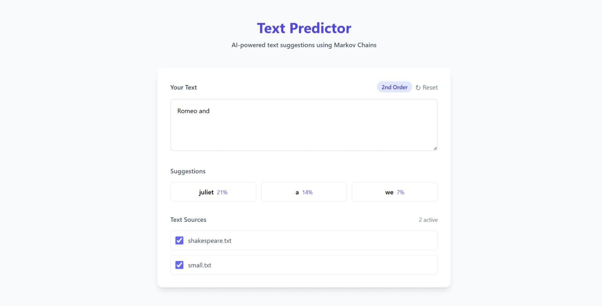

# Text Predictor using Markov Chains
---



## Overview
---

This project is an AI-powered web application that uses Markov Chains to predict and suggest the next words based on user input. Built with Flask, it provides an interactive interface for text prediction, leveraging  a statistical model to analyze patterns in text sources.

## Motivation
---

This project was created as part of the 2nd semester Probability and Statistics course for the BS AI program. The task was to demonstrate a practical application of a probability concept in AI.

## How It Works
---

This app predicts the next words as you type by learning from text sources. It uses a probability model called a Markov Chain, which looks at the last one or two words you wrote to guess what might come next. For example, if you type "Romeo and" it suggests words that often follow, like "Juliet" based on patterns in the training texts. You can also choose which texts to use for predictions through the app’s interface.


## Features
---

- Generates up to three word suggestions with probabilities using first and second-order Markov Chains.
- Supports dynamic addition and toggling of text sources for training the model.  
- Provides real-time predictions with a debounced input handler for optimized performance.
- Displays the Markov Chain order (1st or 2nd) used for predictions.  
- Filters out invalid tokens, ensuring only meaningful words are used in predictions.  
- Offers a reset button to clear input and suggestions.
- Logs prediction request times for performance monitoring.
- Features a responsive front-end with suggestion chips and a loading overlay for smooth interaction.
- Automatically loads `.txt` files from a sources directory for model training. If no txt file is found, it uses hardcoded sample passages for training.

## Tech Stack
---

- **Backend**: Python, Flask (2.3.2), NLTK (3.8.1)  
- **Frontend**: HTML, JavaScript, Tailwind CSS  
- **Version Control**: Git

## Project Directory Structure
---

```
MarkovTextPrediction/
│
├── sources/                    # Directory for text source files
│   ├── shakespeare.txt         # Sample text source
│   └── small.txt               # Sample text source
├── ss/
│   └── image.jpeg              # Screenshot of the website
├── static/                     
│   └── script.js               # JavaScript for frontend logic
├── templates/                  
│   └── index.html              # Main HTML template
├── .gitignore                  
├── app.py                      # Main Flask application file
├── markov_chain.py             # Markov Chain logic implementation
├── README.md                   
├── requirements.txt            # Python dependencies
├── LICENSE                     
```

## Team Members
---

| <a href="https://github.com/samiternity"><br />*_SAMI_*</a> | <a href="https://github.com/IQRA"><br />*_IQRA_*</a> |
| :-------------: | :-------------: |

## Setup and Installation
---

1. **Clone the Repository**:
   ```bash
   git clone https://github.com/yourusername/MarkovTextPrediction.git
   cd MarkovTextPrediction
   ```

2. **Install Dependencies**:
   ```bash
   pip install -r requirements.txt
   ```

3. **Run the Flask App**:
   ```bash
   python app.py
   ```

4. **Access the Application**:
   Open your browser and navigate to `http://localhost:5000`.

## Usage
---

1. **Input Text**: Enter text into the provided input area.  
2. **View Suggestions**: See real-time word suggestions with their probabilities.  
3. **Toggle Sources**: Enable or disable text sources to adjust the training data.  
4. **Reset**: Clear the input and suggestions using the reset button.

## License
---

This project is licensed under the MIT License. See the [LICENSE](LICENSE) file for details.